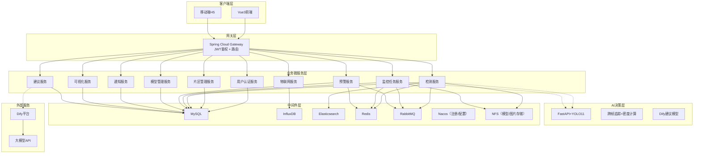

# 智慧农业视觉巡检系统 —— 开发者指南

## 项目简介

本系统面向果园、温室等农业场景，采用 **Spring Cloud Alibaba 微服务架构**，提供**在线检测**（用户上传图片/视频识别病虫害）与**监控检测**（RTSP摄像头实时分析）两种模式，同时接入环境传感器（温度、CO₂等）和病虫害密度预警，并结合**预防治理建议模型**（基于 RAG 知识库 + Function Calling）生成科学的防治方案，实现“感知 → 分析 → 预警 → 处置 → 建议”的完整业务闭环。

## 整体架构

## 微服务模块划分与实现思路

### 1. 用户认证服务（auth-service）
- **功能**：RBAC 用户管理、登录/登出、JWT 签发与刷新、角色权限校验。
- **实现**：Spring Security + OAuth2 资源服务器，权限数据存储在 MySQL，密码加密使用 sha256。
- **对外接口**：`/auth/login`、`/auth/logout`、`/auth/refresh`、`/auth/check`。

### 2. 片区管理服务（farm-service）
- **功能**：片区、片区类型、传感器设备、农作物数据库、病虫害数据库（含检测标签映射）的 CRUD。
- **实现**：独立数据库表，通过 OpenFeign 供其他服务调用。
- **数据流向**：预警服务通过 Feign 获取片区阈值配置；检测服务获取病虫害映射信息。

### 3. 检测服务（detect-service）
- **功能**：在线检测（图片/视频），调用 FastAPI 模型推理，记录检测日志（主表 + 详情表），并异步写入 Elasticsearch 用于全文检索。
- **实现**：
  - 接收前端上传文件 → 通过 OpenFeign 调用 FastAPI 服务（负载均衡 + Sentinel 熔断）→ 保存结果到 MySQL 和 ES。
  - 视频检测仅存储汇总信息，原始文件存 NFS。
  - 检测完成后，将日志 ID 通过 RabbitMQ 发送给“模型反馈收集”队列。
- **异步**：大文件检测异步处理，返回任务 ID，客户端轮询结果。

### 4. 监控任务服务（monitor-service）
- **功能**：管理摄像头设备、监控任务配置（抽帧频率、模型、绑定的片区）。任务运行时，拉取 RTSP 流，抽帧后调用 FastAPI 进行检测，并通过跨帧追踪（IOU+Kalman）去重，计算病虫害密度，若超阈值则通过 Feign 调用预警服务生成预警日志。
- **实现**：
  - 任务配置存入 MySQL，使用分布式调度（如 XXL-Job 或基于 Redis 分布式锁的 Spring Scheduled）确保每个摄像头只被一个实例处理。
  - 检测结果和密度数据写入 InfluxDB（时序数据），用于趋势分析。
  - 超阈值时通过 RabbitMQ 发送预警触发消息（解耦），由预警服务消费并持久化。

### 5. 预警服务（alert-service）
- **功能**：阈值配置、预警日志管理、环境数据接收（MQTT 传感器数据）、预警自动恢复判断、人工处置记录。
- **实现**：
  - 订阅 RabbitMQ 的预警触发队列（来自监控任务服务和物联网服务），写入 `alert_history`。
  - 定时任务扫描未恢复预警，检查环境数据或密度是否已正常，自动恢复。
  - 提供接口供前端查询预警列表、更新处置状态、调用建议服务。

### 6. 模型管理服务（model-service）
- **功能**：扫描 NFS 上的模型目录，自动添加/更新模型配置，支持启用/停用。
- **实现**：定时扫描指定路径，读取 `.pt` 文件元数据，存入 MySQL 的 `model_config` 表；对外提供模型列表查询接口。

### 7. 物联网服务（iot-service）
- **功能**：基于 Netty 的 MQTT Broker，接收传感器上报数据，验证阈值并触发预警。
- **实现**：
  - 独立 Spring Boot 应用，集成 `netty-mqtt` 或 `moquette`。
  - 收到数据后写入 InfluxDB，同时比对当前片区的 `alert_threshold`，超阈值则发送 RabbitMQ 预警消息。
  - 传感器离线状态检测：定时任务检查设备最后通讯时间，生成“设备离线”预警。

### 8. 通知服务（notice-service）
- **功能**：站内通知、邮件/钉钉推送（可选）。
- **实现**：消费 RabbitMQ 的通知队列（预警触发、任务完成等），存储站内通知到 MySQL，并提供查询接口；支持扩展邮件发送。

### 9. 可视化服务（visual-service）
- **功能**：提供 ECharts 所需的统计接口（近7天检测趋势、病虫害 Top5、各片区发生率、实时环境仪表盘）。
- **实现**：聚合 MySQL、InfluxDB、ES 中的数据，返回 JSON 供前端渲染。

### 10. 建议服务（advice-service）
- **功能**：调用 Dify 工作流，基于 RAG 知识库（病虫害数据库）和 Function Calling（获取实时环境数据）生成防治建议。
- **实现**：通过 HTTP 调用 Dify API，传入预警 ID 或病虫害 ID，Dify 工作流内部完成知识库检索、工具调用，返回 Markdown 格式建议。

## 服务间通信与关键闭环

| 场景 | 通信方式 | 说明 |
|------|----------|------|
| 前端 → 后端 | HTTP → Gateway（JWT验证）→ 各微服务 | 统一入口，路由分发 |
| 检测服务 → FastAPI | OpenFeign + Nacos 负载均衡 | 同步调用，Sentinel 熔断 |
| 监控任务 → 预警服务 | Feign 同步 + RabbitMQ 异步 | 超阈值时同步调用可能阻塞，采用先发消息再异步处理 |
| 物联网服务 → 预警服务 | RabbitMQ | 高频传感器数据，异步解耦 |
| 预警服务 → 通知服务 | RabbitMQ | 预警产生后异步发通知 |
| 检测日志 → Elasticsearch | 异步写入 | 提升搜索性能 |
| 监控任务调度锁 | Redis 分布式锁 | 保证每摄像头单实例处理 |

## 技术栈汇总

| 类别 | 技术 |
|------|------|
| 微服务框架 | Spring Cloud Alibaba（Nacos、Sentinel、OpenFeign） |
| 网关 | Spring Cloud Gateway |
| 认证授权 | Spring Security + JWT（无状态） |
| 服务容错 | Sentinel（熔断、限流、降级） |
| 消息队列 | RabbitMQ |
| 搜索引擎 | Elasticsearch（检测日志、病虫害库检索） |
| 时序数据库 | InfluxDB 3.x |
| 关系数据库 | MySQL 8.0 |
| 缓存/分布式锁 | Redis |
| 模型与图片存储 | NFS（共享存储） |
| AI 推理服务 | Python 3.10 + FastAPI + YOLOv11（注册到 Nacos） |
| 大模型平台 | Dify（RAG + Function Calling） |
| 前端 | Vue3 + Element Plus + ECharts + WebRTC API |

## 项目启动顺序（本地开发）

1. 启动 MySQL、Redis、InfluxDB、Elasticsearch、RabbitMQ。
2. 启动 Nacos 服务（作为注册中心和配置中心）。
3. 启动 Netty MQTT Broker（物联网服务中的组件）。
4. 启动 FastAPI 服务（并注册到 Nacos）。
5. 按顺序启动微服务：用户认证服务 → 片区管理服务 → 模型管理服务 → 预警服务 → 通知服务 → 可视化服务 → 建议服务 → 检测服务 → 监控任务服务 → 物联网服务。
6. 启动 Gateway。
7. 启动 Vue3 前端项目（通过 Gateway 访问后端）。
