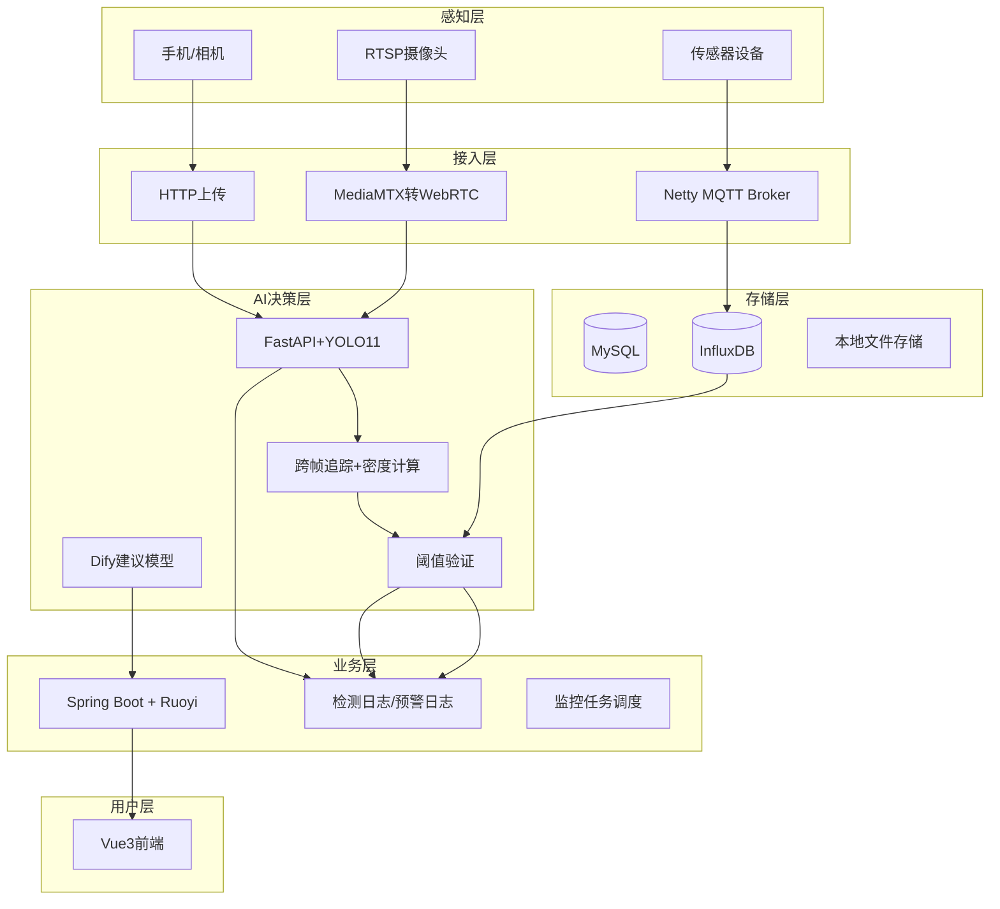

# 智慧农业视觉巡检系统

## 项目简介

本系统面向果园、温室等农业场景，提供**在线检测**（用户上传图片/视频识别病虫害）与**监控检测**（RTSP摄像头实时分析）两种模式，同时接入环境传感器（温度、CO₂等）和病虫害密度预警，并结合**预防治理建议模型**（基于 RAG 知识库 + Function Calling）生成科学的防治方案，实现“感知 → 分析 → 预警 → 处置 → 建议”的完整业务闭环。

## 整体架构

## 模块功能与实现思路

### 1. RBAC 用户管理
- **功能**：基于 Ruoyi 框架，实现用户、角色、权限的精细隔离。普通用户只能查看/操作自己创建的检测记录，管理员可查看全部。
- **实现**：复用 Ruoyi 的 `sys_user`、`sys_role`、`sys_menu` 等表，通过 `@PreAuthorize` 注解控制接口权限。

### 2. 片区管理
- **功能**：维护农田/温室基础信息（名称、地理位置、面积、类型、管理者）。
- **详情页**：展示该片区所有环境检测类型的最新实时值及对应的阈值。
- **实现**：`farm_plot` 表，关联 `plot_type`、`manager_id`。

### 3. 片区类型管理
- **功能**：动态配置片区类别（温室、露天、水田等），便于分类统计。
- **实现**：`plot_type` 表。

### 4. 片区传感器管理
- **功能**：管理每个片区部署的传感器（设备ID、类型、采集频率、最后通讯时间、在线状态）。离线时自动告警。
- **实现**：
    - 独立 Netty 服务实现 MQTT Broker，接收传感器上报数据。
    - 数据写入 InfluxDB 时序数据库。
    - 每次插入数据时调用阈值验证服务，触发预警。

### 5. 环境检测类型
- **功能**：动态配置可监测的指标类型，包括温湿度、CO₂，以及病虫害密度（如锈病密度、蚜虫密度等）。
- **实现**：`alert_type` 表，含单位、备注等。

### 6. 阈值预警
- **功能**：为每个片区、每种环境检测类型设置独立阈值（上下限）。病虫害密度阈值在此统一配置，监控任务只读使用。
- **实现**：`alert_threshold` 表，唯一索引 `(plot_id, alert_type_id)`。

### 7. 预警日志
- **功能**：记录每次触发预警的详细信息。区分环境异常（温度/CO₂）和病虫害异常（记录具体病虫害名称）。状态流转：未处理 → 处理完成（可自动/人工）。支持关联防治建议模型。
- **自动恢复**：环境数据连续 N 次恢复正常或密度连续低于阈值后自动关闭；人工也可修改状态及备注。
- **实现**：`alert_history` 表，含 `status`、`trigger_time`、`recovery_time`、`duration_minutes`、`pest_id`（可选）、`remark`。

### 8. 农作物数据库管理
- **功能**：管理正常农作物样本（名称、品种、图片等），作为知识库的一部分。
- **实现**：`crop` 表，关联 `variety`（品种）表。

### 9. 病虫害数据库（标签映射表）
- **功能**：存储病虫害条目（名称、症状、诱因、防治方法、典型图片），同时作为模型输出标签的业务映射。例如模型输出 `rust`，通过映射表找到病虫害ID，进而关联防治知识。
- **实现**：`pest` 表 + `model_label_mapping`（模型标签 → pest_id + alert_type_id）。

### 10. 模型推理服务（Python FastAPI + YOLOv11）
- **功能**：提供检测/分割接口，接收图片返回标注图、每个目标的类别、置信度、位置信息。
- **实现**：独立服务，使用 Ultralytics YOLO 库，通过 HTTP 与 Java 后端通信。

### 11. 检测日志
- **功能**：记录每次在线检测（图片/视频）的完整信息，含原始文件、结果图、用户反馈。
- **视频检测**：只存储汇总数据（总帧数、各类别总检出数、平均置信度），不保存每一帧详情。
- **隔离**：用户只能看到自己创建的日志，管理员可看全部。
- **实现**：主表 `detection_log`，详情表 `detection_log_detail`；用户ID关联 `sys_user`。

### 12. 在线检测
- **功能**：用户主动上传图片/视频 → 调用模型 → 保存日志 → 返回标注结果。
- **闭环**：检测结果可被用户反馈（准确/不准确），不准确的数据可导出用于模型重训练。
- **实现**：前端调用后端接口，后端将文件转发给 FastAPI，保存日志后返回。

### 13. 设备管理（摄像头）
- **功能**：维护每个片区的监控摄像头信息（名称、RTSP地址、状态、厂商等）。
- **实现**：`monitor_dev` 表，关联 `plot_id`。

### 14. 监控任务
- **功能**：为摄像头创建任务，配置抽帧频率（如每秒1帧）、使用的检测模型。密度阈值从 `alert_threshold` 读取（只读）。运行时若某病虫害密度超过阈值，触发预警日志。
- **实现**：后台定时任务（Spring Schedule 或 Quartz），根据任务配置拉取 RTSP 流，抽帧后调用检测服务，经跨帧追踪去重，计算密度并与阈值比对。

### 15. 监控检测（实时画面）
- **功能**：前端选择摄像头 → 后端通过 MediaMTX 将 RTSP 转为 WebRTC → 浏览器无插件播放实时视频，同时可叠加检测框（可选）。
- **实现**：部署 MediaMTX 服务，后端提供 WebRTC 信令接口，前端使用 WebRTC API 播放。

### 16. 用户反馈收集
- **功能**：每次在线检测后，用户可标记“准确/不准确”并填写原因。
- **实现**：更新 `detection_log` 的 `feedback_status`、`feedback_text` 字段。

### 17. 模型用户反馈（可视化）
- **功能**：统计每个模型的准确率、不准确原因分布，用 ECharts 展示。
- **实现**：后端根据 `detection_log` 中 `model_config_id` 分组统计。

### 18. 模型管理与配置
- **功能**：管理员将 `.pt` 模型文件放入服务器指定目录，系统自动扫描识别新模型并添加到配置列表，支持启用/停用。
- **实现**：定时扫描目录，读取文件元数据，写入 `model_config` 表；避免大文件通过 Web 上传。

### 19. 预防治理建议模型（Dify + RAG + Function Calling）
- **功能**：基于病虫害数据库构建 RAG 知识库，并结合 Function Calling 获取片区实时温湿度等环境数据，生成针对性的防治、预防、治理建议。
- **实现**：
    - 将 `pest` 表中的症状、诱因、防治方法等字段文本化，导入 Dify 知识库。
    - 在 Dify 中定义工具 `get_plot_env`，调用后端 API 获取指定片区最新环境数据。
    - 编排工作流：知识库检索 → 判断是否需要实时数据 → 调用工具 → 大模型生成建议。
    - 后端提供触发接口，前端预警详情页或片区详情页调用，展示 Markdown 格式建议。

### 20. 可视化图表展示
- **近7天检测趋势**：按天统计检测次数（折线图）。
- **病虫害检出Top5**：按类别统计（饼图/柱状图）。
- **各片区病虫害发生率**：从预警日志中统计每个片区的病虫害预警次数（地图/柱状图）。
- **实时环境数据仪表盘**：查询 InfluxDB 最新数据，展示温湿度等（可滚动）。
- **实现**：后端提供统计接口，前端使用 ECharts 渲染。

### 21. 首页预警滚动栏 + 片区信息 + 天气预报
- **预警滚动栏**：查询 `alert_history` 中未解除的记录，取最近5条。
- **片区简单信息**：展示所有片区名称、最新环境数据。
- **今日天气预报**：调用高德/和风天气 API，根据片区地理位置获取。
- **实现**：后端聚合数据，前端定时刷新（如每30秒）。

## 关键闭环逻辑

| 闭环类型 | 数据流路径 |
|----------|------------|
| **环境预警闭环** | 传感器 → MQTT → InfluxDB → 阈值验证 → 预警日志（自动恢复或人工处理） |
| **病虫害预警闭环** | 摄像头 RTSP → 监控任务 → 抽帧 → YOLO检测 → 跨帧追踪去重 → 密度计算 → 超阈值 → 预警日志（自动恢复或人工处理） |
| **在线检测反馈闭环** | 用户上传图片 → 在线检测 → 保存日志 → 用户反馈 → 导出错误数据 → 重训练模型 |
| **防治建议闭环** | 预警详情页 → 调用 Dify 工作流 → 知识库检索 + 实时环境数据 → 大模型生成建议 → 前端展示 |

## 技术栈

| 层级 | 技术 |
|------|------|
| 后端框架 | Spring Boot 2.7+, Ruoyi, MyBatis-Plus |
| AI 推理服务 | Python 3.10+, FastAPI, Ultralytics YOLOv11, OpenCV |
| 时序数据库 | InfluxDB 2.x |
| 关系数据库 | MySQL 8.0 |
| 缓存 | Redis |
| MQTT Broker | Netty 自建服务 |
| 流媒体 | MediaMTX（RTSP → WebRTC） |
| 大模型平台 | Dify（RAG + Function Calling） |
| 前端 | Vue3, Element Plus, ECharts, WebRTC API |
| 构建工具 | Maven, npm |

## 项目启动顺序

1. 启动 MySQL、Redis、InfluxDB。
2. 启动 Netty MQTT 服务（接收传感器数据）。
3. 启动 Python FastAPI 模型服务。
4. 启动 Spring Boot 后端服务。
5. 启动 MediaMTX 服务。
6. 启动 Vue3 前端项目。

## 后续扩展方向

- 支持无人机巡检任务自动规划路径。
- 增加模型 A/B 测试与自动部署。
- 接入多光谱相机实现早期病害识别。
- 优化 Dify 工作流，引入历史数据分析预测病虫害爆发趋势。